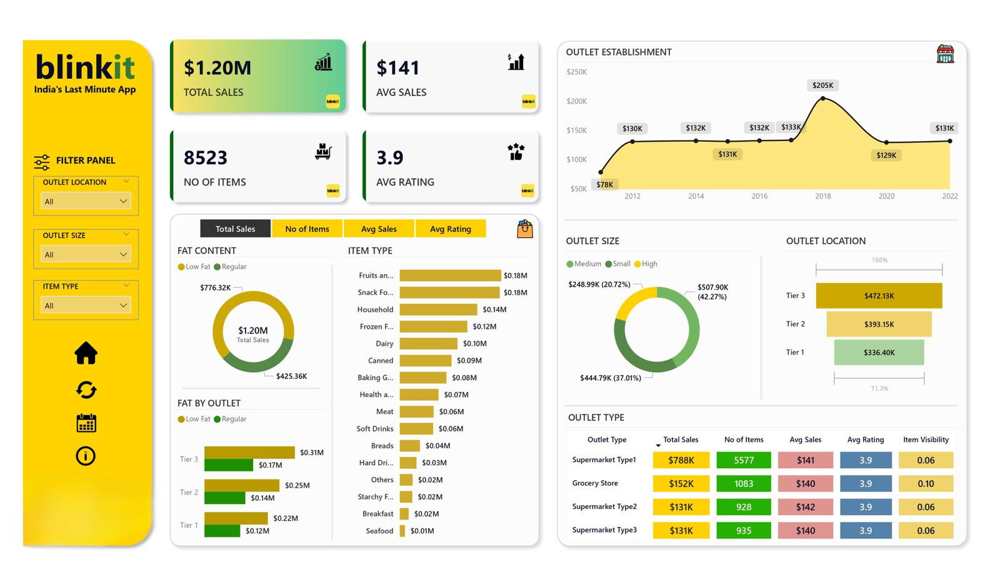

# 🛒 Blinkit Data Analysis — Power BI Dashboard

> **An interactive Power BI dashboard to analyze Blinkit grocery sales, item mix, and outlet performance.**  
> This repo includes the dataset, the `.pbix` report, and export-ready visuals for your portfolio.

  

---

## 📌 Project Snapshot

- **Goal:** Explore sales performance, average sales, outlet types/sizes/locations, and item categories to uncover actionable insights.  
- **Stack:** Power BI Desktop (DAX measures, slicers, tooltips), Excel (data source).  
- **Data:** `blinkit_grocery_data.xlsx` (sample retail dataset).  
- **Status:** v1 — ready to view; future scope below.

---

## 🧭 Table of Contents
- [Dataset](#-dataset)  
- [KPIs & Measures](#-kpis--measures)  
- [Dashboard Highlights](#-dashboard-highlights)  
- [How to Use](#-how-to-use)  
- [Repository Structure](#-repository-structure)  
- [Key Insights (Examples)](#-key-insights-examples)  
- [Enhancements Roadmap](#-enhancements-roadmap)  
- [Credits](#-credits)

---

## 📂 Dataset

- **File:** `blinkit_grocery_data.xlsx`  
- **Typical columns:** Item Type, Fat Content, Outlet Type, Outlet Size, Outlet Location, Establishment Year, Sales, Rating, etc.  
- **Data prep (Power BI):** Removed duplicates/blank rows, standardized categories, basic calculated columns & measures.

> Tip: Keep the file as **.xlsx** for the smoothest refresh in Power BI.

---

## 📊 KPIs & Measures

- **Total Sales** — sum of item sales across all outlets  
- **Average Sales** — mean sale value per record  
- **No. of Items** — distinct count of items listed  
- **Average Rating** — mean item rating  
- **Slicer Context** — Outlet Size / Type / Location, Item Type, Fat Content

---

## 🌟 Dashboard Highlights

- **Filter Panel:** Slice instantly by Item Type, Fat Content, Outlet Type/Size/Location.  
- **Sales Trend:** Establishment-year line to spot growth/decline.  
- **Category Mix:** Bar charts for item types and fat content.  
- **Outlet Analysis:** Donut + tables for outlet size, location tier, and type.  
- **Heat-style Matrix:** Color-scaled table for quick cross-segment comparisons.

---

## ▶️ How to Use

1. Open `blinkit_analysis.pbix` in **Power BI Desktop (x64)**.  
2. If Power BI asks for the dataset path, go to **Transform data → Data source settings** and **Change Source** to your local path, then **Refresh**.  
3. Use the slicers (left panel) to explore segments. Click visuals to cross-filter, and hover for tooltips.

> **Troubleshooting:** If you see *“Something went wrong → Class not registered”*, install/repair **Microsoft Edge WebView2 Runtime (Evergreen x64)** and reopen Power BI.

---

## 🔎 Key Insights (Examples)

- **Top Item Types** contribute a disproportionate share of **Total Sales**.  
- **Medium/Large outlet sizes** tend to show higher sales volume than Small.  
- **Tier-2/Tier-3 locations** can outperform Tier-1 depending on item mix.  
- **Fat Content** categories show different **Average Sales** and **Ratings**—useful for targeted promos.

> Replace with quantified findings after exploring your specific filters (e.g., “Snack Foods = 22% of sales”, “Tier-2 Avg Sales +14% vs Tier-1”).

---

## Tools

- Power BI Desktop, Excel, Microsoft Edge WebView2
